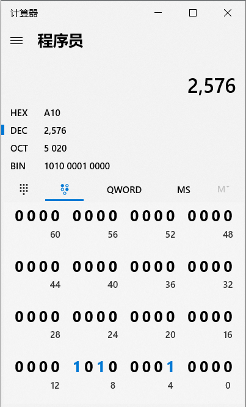
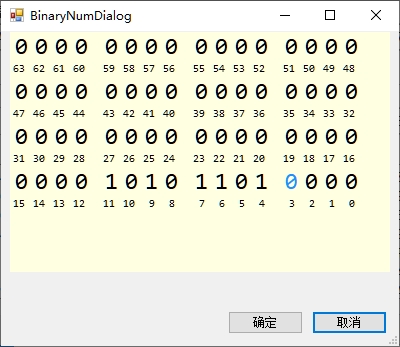

# 二进制数字输入对话框

## 简介

一个WinForm组件，用于输入二进制数字，模仿Windows10 计算器的二进制输入

| Win10 计算器                    | 本组件 |
| ------------------------------- | ------ |
|  |        |

## 用法
1. 下载dll使用，下载地址：[Releases](https://github.com/catmade/BinaryNumInputDialog/releases)
2. 引入dll，详细步骤请自行查阅

3. 使用，如以下伪代码。具体用法请参考：[catmade/IEEE802.3-Frame  ...DrawCRC.cs](https://github.com/catmade/IEEE802.3-Frame/blob/b7d77ddb0a5e46140eaac66dd9f735835bbf4f53/IEEE%20802.3%20%E4%BB%A5%E5%A4%AA%E7%BD%91%E5%B8%A7%E5%B0%81%E8%A3%85/MyUserContorl/DrawCRC.cs#L105)

```c#
// 声明
BinaryNumInputDialog binaryDialog = new BinaryNumInputDialog();

// 弹窗，并判断是否点击了确认按钮来g
if (binaryDialog.ShowDialog() == DialogResult.OK)
{
    // 获取二进制字符串
    var numStringInBinary = binaryDialog.BinaryString;
}
```


